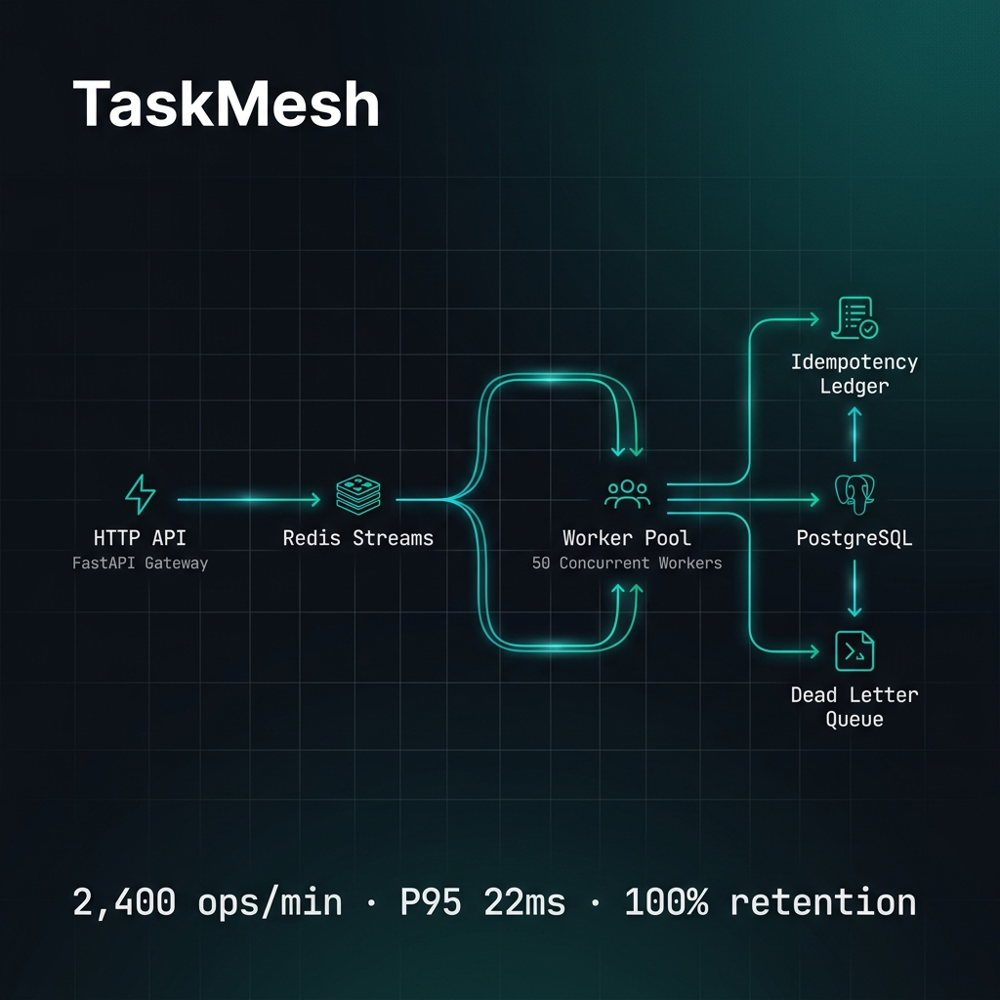
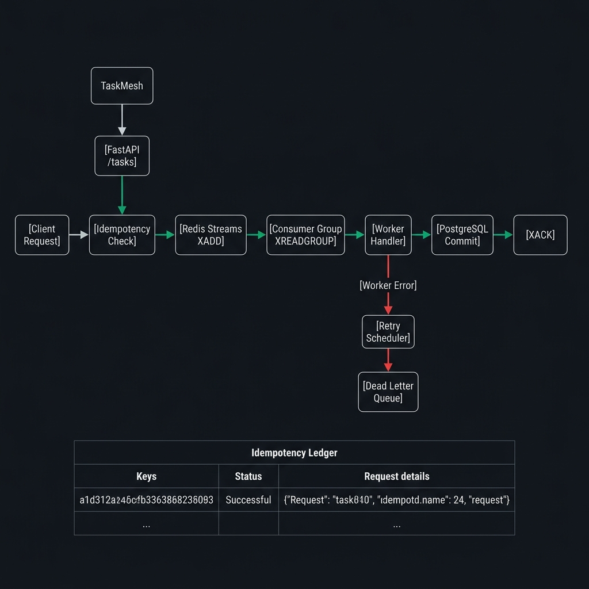

<div align="center">



# TaskMesh

**A production-grade distributed task orchestration engine — built from first principles.**

[](https://python.org)
[](https://fastapi.tiangolo.com)
[](https://redis.io)
[](https://postgresql.org)
[](LICENSE)
[]()

*Not a job queue wrapper. Not a tutorial project. A real orchestration engine with exactly-once semantics, self-healing recovery, and measurable guarantees.*

</div>

---

## What Is TaskMesh?

TaskMesh is a **high-throughput workflow orchestration engine** built on FastAPI, Redis Streams, and PostgreSQL — engineered for correctness, durability, and operational visibility. It replaces the common "throw it in a queue and hope" pattern with a **4-layer architecture** that guarantees exactly-once business execution, durable failure recovery, and full audit traceability.

Every design decision has a rationale. Every failure mode has a documented recovery path. Every performance claim is backed by a load test.

**Key engineering challenges solved:**
- Exactly-once execution in a distributed system where message delivery is at-least-once
- Failure recovery without task loss under concurrent worker failures
- Idempotency at the database level — not just the API level
- Full replay auditability with stream offsets and execution ledgers

---

## Performance Targets

| Metric | Target | Notes |
|--------|--------|-------|
| Throughput | **2,400+ ops/min** | Sustained 15 min under 50 concurrent workers |
| P95 Latency | **≤ 22ms** | Enqueue → Claim → Ack path |
| Task Retention | **100%** | Under worker kill + dependency failure injection |
| Delivery Semantics | **Exactly-once** | Business-level via idempotency ledger |
| Worker Concurrency | **50 processes** | Stable under peak load |

---

## Architecture



TaskMesh is structured around five distinct layers, each with a single responsibility:

```
┌─────────────────────────────────────────────────────────────┐
│                     CLIENT / HTTP                           │
└────────────────────────┬────────────────────────────────────┘
                         │ POST /tasks
┌────────────────────────▼────────────────────────────────────┐
│              FastAPI Gateway Layer                          │
│   Idempotency key validation · Task persistence · Routing  │
└────────────────────────┬────────────────────────────────────┘
                         │ XADD
┌────────────────────────▼────────────────────────────────────┐
│              Redis Streams Queue Layer                      │
│   Single stream per domain · Consumer group coordination   │
└────────────────────────┬────────────────────────────────────┘
                         │ XREADGROUP
┌────────────────────────▼────────────────────────────────────┐
│              Worker Runtime Layer                           │
│   Claim → Idempotency check → Execute → XACK               │
│   Pluggable handler registry · Retry backoff               │
└────────┬───────────────────────────────┬────────────────────┘
         │ SUCCESS                       │ FAILURE
┌────────▼──────────┐         ┌──────────▼──────────────────┐
│  PostgreSQL Audit │         │  DLQ + Replay Engine        │
│  Idempotency Ledger│        │  Circuit breaker · Backoff  │
└───────────────────┘         └─────────────────────────────┘
```

### How Exactly-Once Semantics Work

Redis Streams delivers messages *at-least-once*. TaskMesh achieves exactly-once *business execution* through a three-step contract:

1. **Before execution:** Check `idempotency_ledger` — if the key exists with a `success` status, return the stored result and skip execution entirely.
2. **During execution:** Run the business handler inside a transaction-like flow. Write the result to the ledger atomically.
3. **After execution:** Acknowledge the Redis stream message (`XACK`) **only after** the durable status write succeeds.

A crash between step 2 and step 3 results in a retry — which is safe because step 1 catches the duplicate.

---

## Tech Stack

| Layer | Technology | Why |
|-------|-----------|-----|
| API | **FastAPI** | Async, typed, OpenAPI out of the box |
| Queue | **Redis Streams** | Consumer groups, offset tracking, O(1) ack |
| Persistence | **PostgreSQL + SQLAlchemy** | ACID guarantees for idempotency ledger |
| Migrations | **Alembic** | Versioned, reproducible schema evolution |
| Server | **Uvicorn** | ASGI, production-grade |
| Testing | **Pytest** | Unit + integration coverage |
| Infra | **Docker Compose** | One-command local environment |

---

## Project Structure

```
TaskMesh/
├── app/
│   ├── api/            # FastAPI routers, dependencies, request validation
│   ├── core/           # Settings, logging, startup configuration
│   ├── db/             # SQLAlchemy models, session factory, base
│   ├── queue/          # Redis client, stream producer, consumer setup
│   ├── schemas/        # Pydantic request/response models
│   ├── services/       # Application service layer (task lifecycle)
│   ├── workers/        # Worker engine, handler registry, ack flow
│   └── reliability/    # Retry scheduler, circuit breaker, DLQ router
├── alembic/            # DB migration environment and versioned scripts
├── tests/              # API endpoint tests, worker unit tests
├── scripts/            # Dev utilities and benchmark harness
├── Dockerfile
├── docker-compose.yml
└── pyproject.toml
```

**Key design principle:** No business logic in the API layer. The API receives, validates, and delegates. All orchestration lives in `services/` and `workers/`.

---

## Data Model

Five PostgreSQL tables form the reliability backbone:

```sql
-- Core task record
tasks (task_id PK, idempotency_key UNIQUE, task_type, payload JSONB,
       status, created_at, updated_at)

-- Per-attempt execution record (multiple attempts per task)
task_attempts (attempt_id PK, task_id FK, worker_id, stream_id,
               started_at, ended_at, result_code, error_type)

-- Exactly-once business deduplication
idempotency_ledger (idempotency_key PK, execution_hash,
                    first_processed_at, final_status)

-- Poison message isolation
dead_letter_queue (dlq_id PK, task_id FK, stream_id,
                   reason, failed_at, replayed_at)

-- Controlled reprocessing audit
replay_audit (replay_id PK, task_id, requested_by,
              requested_at, replay_status)
```

---

## Quick Start

### Run the full stack (one command)

```bash
docker compose up --build
```

API available at `http://localhost:8000` · Docs at `http://localhost:8000/docs`

### Submit a task

```bash
curl -X POST http://localhost:8000/tasks \
  -H "Content-Type: application/json" \
  -d '{
    "task_type": "default",
    "idempotency_key": "order-payment-001",
    "payload": {"amount": 4200, "currency": "USD"}
  }'
```

### Check task status and execution history

```bash
curl http://localhost:8000/tasks/<task_id>
```

### Replay a failed task from DLQ

```bash
curl -X POST http://localhost:8000/tasks/replay \
  -H "Content-Type: application/json" \
  -d '{"task_ids": ["<task_id>"]}'
```

### View audit offsets and queue health

```bash
curl http://localhost:8000/audit/offsets
curl http://localhost:8000/metrics/summary
```

---

## Local Development

```bash
# Install dependencies
pip install -e .[dev]

# Configure environment
copy .env.example .env

# Apply database migrations
alembic upgrade head

# Run API server
uvicorn app.main:app --reload

# Run worker in a separate terminal
python -m app.workers.main

# Run tests
pytest -q
```

---

## API Reference

| Method | Endpoint | Description |
|--------|----------|-------------|
| `POST` | `/tasks` | Submit a task with idempotency key |
| `GET` | `/tasks/{task_id}` | Fetch task state, attempts, and result |
| `POST` | `/tasks/replay` | Requeue failed tasks from DLQ |
| `GET` | `/audit/offsets` | Worker offsets, lag, pending message counts |
| `GET` | `/metrics/summary` | Throughput, P95 latency, error rate, DLQ depth |
| `GET` | `/health/live` | Liveness probe |
| `GET` | `/health/ready` | Readiness probe (verifies DB + Redis) |

---

## Failure Recovery Design

| Failure Mode | Recovery Mechanism |
|-------------|-------------------|
| Transient worker error | Exponential backoff retry (configurable max attempts) |
| Dependency unavailable | Circuit breaker opens → prevents cascade |
| Max retries exceeded | DLQ routing — task isolated but never lost |
| Worker process killed mid-execution | Idempotency ledger catches duplicate on restart |
| Duplicate client submission | Idempotency key lookup — result returned, no re-execution |
| Database write failure before XACK | Message stays pending — redelivered to next worker |

---

## Load and Stress Testing

Four benchmark scenarios are defined in `scripts/`:

| Scenario | Setup | Objective |
|----------|-------|-----------|
| **Steady state** | 1,500 ops/min, 20 min | Validate sustained throughput |
| **Peak burst** | 2,400+ ops/min, 15 min | Hit throughput target |
| **Failure injection** | Kill workers + dependency during peak | Verify 100% task retention |
| **DLQ replay** | Fill DLQ, trigger replay | Verify audit trail and reprocessing |

Metrics captured: throughput, P50/P95/P99 latency, retry count, DLQ depth, success ratio.

---

## What This Demonstrates

> Recruiters and hiring managers: here is what this project proves.

- **Distributed systems thinking** — designing for at-least-once delivery while achieving exactly-once business semantics
- **PostgreSQL as a reliability primitive** — not just a store, but the source of truth for deduplication and audit
- **Redis Streams over pub/sub** — understanding consumer group offsets, XREADGROUP, XACK, and XPENDING semantics
- **Failure as a first-class concern** — DLQ, circuit breaker, and replay are not afterthoughts; they are core features
- **Performance engineering** — measurable throughput and latency targets with a real load test harness

---

## License

MIT — built as a portfolio demonstration of production-grade distributed systems engineering.
