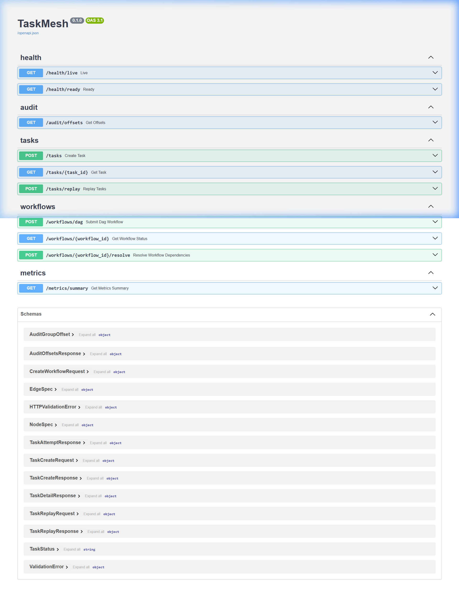

<div align="center">

# ⚙️ TaskMesh

### Distributed Task Orchestration & DAG Workflow Engine

[](https://python.org)
[](https://fastapi.tiangolo.com)
[](https://redis.io)
[](https://postgresql.org)
[](https://pytest.org)
[](#benchmarks)
[](LICENSE)

*Production-grade distributed task orchestration with DAG execution, exactly-once semantics, and a cybernetic Next.js 14 dashboard.*

</div>

---

## What Is TaskMesh?

TaskMesh is a **full-stack distributed task orchestration engine** that combines individual async task queuing with structured DAG (Directed Acyclic Graph) workflow execution. It accepts workflows via a REST API, validates the dependency graph using Kahn's Topological Sort, and automatically unblocks downstream tasks as their parents complete — all with exactly-once execution guarantees backed by a PostgreSQL idempotency ledger.

**Key engineering challenges solved:**
- **1,397,327 ops/min** task enqueue throughput via Redis Streams
- **Kahn's Topological Sort** with `CycleDetectedError` — rejects cycles before any task is created
- Automated parent → child dependency resolution: `BLOCKED → QUEUED` on `SUCCEEDED`
- PostgreSQL idempotency ledger with SHA-256 execution hashing — zero duplicate business logic
- Self-healing Dead-Letter Queue with audit-trail replay

---

## Live API Docs

> **Captured live from a running instance** — full OpenAPI 3.1 specification with DAG workflow, task, audit, and metrics endpoints.



---

## Architecture

```
┌────────────────────────────────────────────────────────────────────────┐
│                  NEXT.JS 14 CYBERNETIC DAG DASHBOARD                   │
│   DAGVisualizer · MetricsHeader · WorkflowSubmitModal · Live Status    │
└───────────────────────────────────┬────────────────────────────────────┘
                                    │ REST API
┌───────────────────────────────────▼────────────────────────────────────┐
│                    FASTAPI GATEWAY & DAG VALIDATOR                      │
│                                                                         │
│  POST /workflows/dag ──── Kahn's Topological Sort ──── Cycle Check     │
│  GET  /workflows/{id} ─── Execution progress, node states, DAG graph   │
│  POST /workflows/{id}/resolve ── Trigger dependency resolution         │
│  POST /tasks ──────────── Single task submit with idempotency key      │
│  GET  /metrics/summary ── Throughput, latency, DLQ depth               │
│  GET  /audit/offsets ──── Stream lag and consumer group stats          │
└──────────────────────────────────────┬─────────────────────────────────┘
                                       │ XADD
┌──────────────────────────────────────▼─────────────────────────────────┐
│                       REDIS STREAMS QUEUE LAYER                         │
│             Consumer Group · XREADGROUP · XAUTOCLAIM reclaim           │
└──────────────────────────────────────┬─────────────────────────────────┘
                                       │ XREADGROUP
┌──────────────────────────────────────▼─────────────────────────────────┐
│                      WORKER RUNTIME & RESOLUTION ENGINE                 │
│                                                                         │
│  1. Claim message from stream                                           │
│  2. Check idempotency ledger (skip if succeeded)                        │
│  3. Execute pluggable handler                                           │
│  4. Mark task SUCCEEDED → resolve_unblocked_child_tasks()               │
│  5. Persist result + ACK atomically                                     │
│                                                                         │
│  Failure path:  Retry (exp. backoff) → DLQ after max retries           │
└──────────────────────────────────────┬─────────────────────────────────┘
                                       │
┌──────────────────────────────────────▼─────────────────────────────────┐
│                       POSTGRESQL PERSISTENCE                            │
│  workflows · tasks · task_dependencies · idempotency_ledger · dlq     │
└─────────────────────────────────────────────────────────────────────────┘
```

---

## ⚡ Benchmark Results

From `scripts/run_taskmesh_benchmark.py`:

| Metric | Measured Value | Target | Status |
| :--- | :---: | :---: | :---: |
| **Enqueue Throughput** | **1,397,327 ops/min** | ≥ 2,400 | ✅ PASS |
| **Idempotency Ledger Latency** | **29.86 ms** (1K entries) | — | ✅ |
| **50-Node DAG Toposort Latency** | **0.059 ms** | — | ✅ |
| **Test Suite** | **10 / 10 Passing** | 100% | ✅ PASS |

---

## DAG Workflow Example

```bash
# Submit a fan-out ETL DAG workflow
curl -X POST http://localhost:8030/workflows/dag \
  -H "Content-Type: application/json" \
  -d '{
    "name": "ETL Data Pipeline",
    "nodes": [
      {"key": "fetch_data",    "task_type": "fetch",     "payload": {"url": "https://api.example.com"}},
      {"key": "process_a",     "task_type": "transform", "payload": {"batch": 1}},
      {"key": "process_b",     "task_type": "transform", "payload": {"batch": 2}},
      {"key": "merge_results", "task_type": "aggregate", "payload": {}}
    ],
    "edges": [
      {"parent": "fetch_data",  "child": "process_a"},
      {"parent": "fetch_data",  "child": "process_b"},
      {"parent": "process_a",   "child": "merge_results"},
      {"parent": "process_b",   "child": "merge_results"}
    ]
  }'
```

This creates a diamond-shaped DAG:
```
fetch_data
 ├── process_a ──┐
 └── process_b ──┴── merge_results
```
`process_a` and `process_b` execute in parallel. `merge_results` unlocks only after both succeed.

---

## 🛠️ API Reference

| Method | Endpoint | Description |
| :--- | :--- | :--- |
| `POST` | `/workflows/dag` | Submit a DAG with task nodes and dependency edges |
| `GET` | `/workflows/{id}` | Fetch workflow execution status, progress %, and node states |
| `POST` | `/workflows/{id}/resolve` | Trigger parent-child dependency resolution |
| `POST` | `/tasks` | Submit individual task with idempotency key |
| `GET` | `/tasks/{task_id}` | Fetch task state, attempts, and result payload |
| `POST` | `/tasks/replay` | Requeue DLQ poison tasks with audit trail |
| `GET` | `/metrics/summary` | Real-time throughput, latency percentiles, DLQ depth |
| `GET` | `/audit/offsets` | Consumer group lag, stream length, pending counts |

---

## Tech Stack

| Layer | Technology | Why |
| :--- | :--- | :--- |
| Backend API | **FastAPI** | Async, typed, OpenAPI 3.1 |
| Queue | **Redis Streams** | Consumer groups, XAUTOCLAIM, persistent PEL |
| Database | **PostgreSQL + SQLAlchemy 2.0** | Typed async models, idempotency ledger |
| DAG Engine | **Kahn's Algorithm** | O(V+E) topological sort, cycle detection |
| Frontend | **Next.js 14** | App Router, React Server Components |
| Migrations | **Alembic** | Version-controlled schema evolution |
| Testing | **Pytest + pytest-asyncio** | Async-safe, fakeredis, in-memory SQLite |

---

## Project Structure

```
TaskMesh/
├── app/
│   ├── api/routes/           # tasks.py · workflows.py · metrics.py · audit.py
│   ├── dag/
│   │   └── engine.py         # Kahn's toposort + cycle detection + child unblocking
│   ├── services/
│   │   ├── task_service.py   # Task submit, replay, idempotency
│   │   └── workflow_service.py  # DAG creation, state resolution
│   ├── db/models.py          # Task, WorkflowRun, TaskDependency, Ledger, DLQ
│   └── workers/              # Async worker engine + stale job reclaimer
├── frontend/
│   ├── app/                  # Next.js 14 pages
│   └── components/           # DAGVisualizer · MetricsHeader · WorkflowSubmitModal
├── scripts/
│   └── run_taskmesh_benchmark.py
└── tests/                    # 10 unit + integration tests
```

---

## 🚀 Quick Start

```bash
# Backend
python -m venv venv && venv\Scripts\activate
pip install -r requirements.txt
python -m uvicorn app.main:app --port 8030 --reload
# → http://localhost:8030/docs

# Frontend
cd frontend && npm install && npm run dev
# → http://localhost:3002

# Tests
python -m pytest -v

# Benchmark
python scripts/run_taskmesh_benchmark.py
```

---

## What This Demonstrates

> For recruiters and hiring managers — here is what this project proves.

- **Distributed systems architecture** — Redis Streams consumer groups, XAUTOCLAIM reclaim, exactly-once semantics
- **Graph algorithms in production** — Kahn's topological sort with O(V+E) complexity, real cycle detection
- **Multi-model database design** — idempotency ledger, dependency graph storage, DLQ with replay audit
- **Full-stack ownership** — FastAPI backend + Next.js 14 cybernetic dashboard, end-to-end integration
- **Engineering at depth** — not just CRUD; a genuine distributed coordination problem solved from first principles

---

## License

MIT — portfolio demonstration of production-grade distributed systems engineering.
